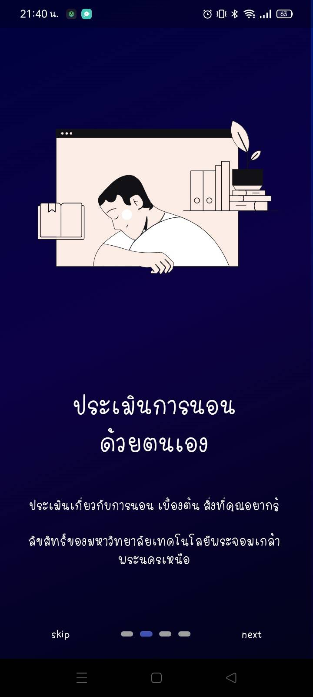

# App_sleep

## รายละเอียดเกี่ยวกับโปรเจกต์

โปรเจกต์ **App_sleep** เป็นระบบที่ผสมผสานระหว่าง **ฮาร์ดแวร์** และ **ซอฟต์แวร์** เพื่อวิเคราะห์และติดตามข้อมูลสุขภาพของผู้ใช้งาน เช่น:
- อัตราการเต้นของหัวใจ
- ค่าออกซิเจนในเลือด

ระบบนี้ออกแบบมาเพื่อช่วยให้ผู้ใช้งานมี **คุณภาพการนอนหลับที่ดีขึ้น** .

---

## รูปภาพตัวอย่าง

<table>
  <tr>
    <td align="center"> <b>ภาพที่ 1</b></td>
    <td align="center"> <b>ภาพที่ 2</b></td>
    <td align="center"> <b>ภาพที่ 3</b></td>
  </tr>
  <tr>
    <td align="center"> <b>ภาพที่ 4</b></td>
    <td align="center"> <b>ภาพที่ 5</b></td>
    <td align="center"> <b>ภาพที่ 6</b></td>
  </tr>
  <tr>
    <td align="center"> <b>ภาพที่ 7</b></td>
    <td align="center"> <b>ภาพที่ 8</b></td>
    <td align="center"> <b>ภาพที่ 9</b></td>
  </tr>
</table>

---

